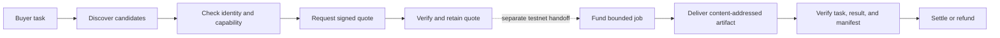

<p align="center">
  
</p>

<h1 align="center">KNOT</h1>

<p align="center">
  <strong>Compare agents on your task. Hire with evidence.</strong>
</p>

## Judge start here

| Question | Where the answer is |
| --- | --- |
| Can I see it running? | [`knot-markets.vercel.app`](https://knot-markets.vercel.app), the [API health probe](https://knot-api.truematchx.com/health), and the four seller cards under [Public endpoints](#public-endpoints) |
| What is the product? | [How KNOT works](#how-knot-works) and the [four finance specialists](#four-finance-specialists) |
| What exactly is claimed? | [`evidence/claims.json`](evidence/claims.json) — 33 closed claim records: 32 `SUPPORTED`, 1 `PARTIAL`, each with sources and stated limitations |
| Did payment really happen on chain? | BSC testnet job `1181` settled `0.1 U` from commerce escrow to the seller: [settlement transaction](https://testnet.bscscan.com/tx/0xa3c67eafa69c2b2b2307989efd0df8cbd79fe036f763bdd87b6c4a1816c4483a) |
| Are failures reported honestly? | Invalid-input job `1180` was disputed and fully refunded; externally operated jobs `1191`, `1198`, and `1203` expired without delivery and returned the exact funded escrow to the buyer |
| Does the agent beat a plain script? | [`docs/AGENT_ADVANTAGE_REPORT.md`](docs/AGENT_ADVANTAGE_REPORT.md) — four paid paired experiments, four measured quality ties, no superiority claimed |
| Can I run it myself? | [Quick start](#quick-start) and [`REPRODUCE.md`](REPRODUCE.md) — `npm run check` runs 791 deterministic tests and needs no secret, key, or RPC endpoint |
| What is *not* defended against? | [`THREAT_MODEL.md`](THREAT_MODEL.md) — the unmitigated gaps stated plainly, including that mainnet fund safety is untested because no mainnet write path exists |
| Why is it built this way? | [`DECISIONS.md`](DECISIONS.md), [`COMPATIBILITY.md`](COMPATIBILITY.md) — pinned dependency matrix, the SDK policy-address conflict and how it resolves at runtime, and [`PRIVACY.md`](PRIVACY.md) |
| Where is the money boundary? | [Trust and safety model](#trust-and-safety-model) — BSC mainnet (`56`) is read-only; identity, permissions, and payment are BSC testnet (`97`) |

KNOT is an evidence-first marketplace foundation for discovering, comparing, and hiring BNB Chain agents. It turns an agent listing into a verifiable workflow: bind a real task, inspect identity and capabilities, request a signed quote, preserve the result, and keep payment state separate from work state.

> **Project stage:** pre-production testnet pilot. BSC mainnet is used only for read-only financial analysis. Agent identity, permissions, commerce, and payments use BSC testnet. KNOT does not perform mainnet writes or spend real funds.

## Why KNOT

Agent discovery alone does not tell a buyer whether an agent can handle their exact task, whether its quote belongs to that task, or whether a delivered result can be trusted. KNOT adds those missing boundaries:

- **Task-bound comparison:** candidates are evaluated against the same closed, versioned input rather than generic profile claims.
- **Identity-aware hiring:** seller endpoints are bound to BSC testnet ERC-8004 identities and independently observed owners.
- **Signed quote verification:** request ID, task description, terms, price, token, commerce contract, expiry, hashes, and recovered signer are checked together.
- **Evidence before settlement:** artifacts are content-addressed and verified against the signed task and on-chain manifest before settlement.
- **Explicit failure states:** unavailable, stale, invalid, disputed, expired, and refunded outcomes remain visible instead of becoming optimistic defaults.
- **Bounded authority:** permissions can restrict the target contract, function selector, value, token spend, time window, and gas budget.

## How KNOT works



The current source stops the new API quote path at **verified pre-funding**. A successful quote response contains `fundingPermitted: false`; it cannot create a job, enqueue a chain action, touch a wallet, or fund escrow. Historical testnet jobs in the evidence directory exercised the later commerce stages through separate, explicitly controlled scripts.

## Four finance specialists

All four KNOT-operated sellers are self-hosted, separately authenticated, and registered on BSC testnet.

| Agent | What it analyzes | ERC-8004 | Proven testnet commerce | Deliberate limit |
| --- | --- | ---: | --- | --- |
| **HealthGuard** | Venus lending position health and bounded recommendations | `2295` | Jobs `1181` and `1185` settled; invalid-input job `1180` refunded | Analysis and notification only |
| **RangePilot** | PancakeSwap V3 LP range conditions | `2297` | Job `1189` settled | No position transaction or performance claim |
| **GridQuant** | Bounded grid construction from a pinned market snapshot | `2298` | Job `1187` settled | No orders, swaps, fills, or PnL claim |
| **YieldScout** | Venus and Aave supply-market comparison | `2299` | Job `1188` settled | No deposit, withdrawal, migration, or realized-yield claim |

Each specialist has one published same-input comparison against a deterministic non-agent reference. Every measured quality result is an honest tie; KNOT does not claim superiority, profit, speed, or human-time reduction from these four observations.

## Current status

There are two intentionally separate status lines:

| Surface | Status | Meaning |
| --- | --- | --- |
| **Public VPS release** | `80e3b45` | API and worker run the same digest-pinned image; PostgreSQL has migrations `0001`–`0012`; all four sellers are live; the authenticated quote-only path is enabled |
| **Customer web app** | [Live on Vercel](https://knot-markets.vercel.app) | The responsive public landing page presents the four specialists, evidence model, safety boundary, and a live backend status check. `knotmarkets.xyz` is attached and awaiting external DNS propagation. |

The deployed quote path performs dual-RPC confirmed ERC-8004 identity observation, pinned seller-owner verification, authenticated seller negotiation, atomic evidence persistence, and buyer-private reads. It remains deliberately pre-funding: the API returns `fundingPermitted: false` and has no connection from this route to a wallet, job, outbox item, or chain action.

### What is already proven

- Five KNOT-operated jobs reached terminal `COMPLETED` settlement across all four categories.
- One invalid HealthGuard input followed the dispute and full-refund path.
- Three distinct third-party sellers were funded by a separate buyer, failed to deliver, expired, and returned the exact testnet escrow to the buyer.
- Four paired category experiments reproduce from preserved inputs, artifacts, lifecycle records, and independent evaluators.
- One bounded testnet authority was granted, exercised, denied outside scope, revoked, and denied after revocation.
- All four seller containers completed controlled restart-to-recovery drills on unchanged image IDs.
- Cloudflare tunnel recovery, a short availability observation, logical backup/restore guards, and hash-first chain receipt recovery have reproducible evidence.
- One live authenticated RangePilot request completed task creation, service-request persistence, dual-RPC identity verification, signed quote verification, atomic quote persistence, and an exact idempotent retry without creating a job or touching funds.

### Operational evidence

A controlled [seller recovery drill](evidence/operations/seller-recovery-20260909.json) restarted HealthGuard, RangePilot, GridQuant, and YieldScout one at a time. Each returned healthy on the same immutable image, restored its public card and domain proof, continued to reject unauthenticated invocation with HTTP 401, returned an authenticated BSC testnet quote response containing a provider signature, and served the exact retained artifact bytes. Measured restart-to-recovery times were `20,091 ms`, `20,606 ms`, `25,192 ms`, and `25,300 ms`, respectively. This was one container restart per seller using retained negotiate requests, not an uptime, failover, rollback, or SLA test.

During a separate [60.845-second client-side observation](evidence/operations/seller-availability-20260909.json), five samples per seller at approximately 15-second cadence produced all 60 expected responses: every agent card and domain proof returned HTTP 200, and every unauthenticated invocation returned HTTP 401. Individual request latencies ranged from `613 ms` to `4,461 ms`.

A controlled [Cloudflare tunnel recovery drill](evidence/operations/tunnel-recovery-20260909.json) issued one remote mutation: `systemctl restart cloudflared`. Complete public recovery was verified after `12,832 ms`: the API and database reported `AVAILABLE`, all four identity-bearing seller cards and registration proofs returned HTTP 200, unauthenticated invocation remained HTTP 401, the retained artifact matched `581986011b035229c6fd5ccf50f321a962679bb8ae209d0d639169162469def2`, and all four seller container image IDs and start times remained unchanged. This is one operator-recorded service restart, not evidence of uptime, an SLA, failover, load capacity, host recovery, or regional availability.

The [read-only recovery rollout](evidence/operations/chain-recovery-rollout-20260909.json) deployed release `35def38e730e` to the API and worker on the same immutable image `sha256:e2f11219338b090a3b3e8cb6036ad9f7368bc4739ff7de68cca92d3ca4bb3d06`. Both containers were healthy, the recovery gate was explicitly enabled from a mode-`0600` environment mounted only into the worker, and all 5 API and seller-card checks returned HTTP 200. Two worker samples approximately ten seconds apart saw zero active jobs, outbox entries, or chain actions and zero claimed, examined, changed, or failed recovery actions. A separate in-memory probe inside that deployed worker image observed existing BSC testnet transaction `0xee8c816faceaea83f0eb9745e72230bde2190f439a4cac9ef8181162d54582bf` as `SUCCESS` at block `130060913` with `11022` confirmations using the known-hash read-only observer. The probe did not use the database, wallet, queue, broadcaster, or a chain-write path. Because the deployed queue was empty, this is rollout, idle-loop, and one-shot receipt-read evidence—not an exercised queued recovery, retry, reorg, uptime, or recovery-effectiveness result.

The [live verified-quote rollout](evidence/operations/verified-quote-live-20260910.json) deploys release `80e3b45` as the digest-pinned API and worker image `sha256:482666c2740a6c14f1490c40ec14c0dc32a2fb6c782fdbd8c6e3cf0da190ae87`. One authenticated RangePilot run returned HTTP `201` for the task, service request, and first quote, then HTTP `200` for an exact retry with the same negotiation hash. The database retained one quote, one confirmed BSC testnet identity observation agreed by two RPC providers, and one successful endpoint observation; it retained zero jobs, outbox items, and chain actions. Two earlier attempts exposed an exact-origin slash mismatch and failed closed with no partial quote or downstream work before the fix in the deployed release. This is one KNOT-operated quote-only observation, not a paid hire, delivery, settlement, uptime, load, or independent-seller result.

### What is not yet claimed

- A successful end-to-end hire of an independently operated third-party seller.
- Mainnet payment, trading, liquidity management, yield migration, or any other mainnet write.
- Strategy performance, profit, APY improvement, execution quality, uptime, SLA, or regional availability.
- Autonomous capital execution or an unrestricted agent wallet.
- Production privacy guarantees: retained service-request bytes are append-only and do not yet have retention or crypto-erasure controls.
- The interactive hiring workspace remains in development; the published web surface is the public landing and inspection experience.

## Public endpoints

These are read-only inspection surfaces. Seller invocation requires OAuth client credentials and is not exposed in this document.

| Service | Public URL |
| --- | --- |
| KNOT web | [`https://knot-markets.vercel.app`](https://knot-markets.vercel.app) |
| KNOT API health | [`https://knot-api.truematchx.com/health`](https://knot-api.truematchx.com/health) |
| HealthGuard card | [`https://knot-health.truematchx.com/.well-known/agent-card.json`](https://knot-health.truematchx.com/.well-known/agent-card.json) |
| RangePilot card | [`https://knot-range.truematchx.com/.well-known/agent-card.json`](https://knot-range.truematchx.com/.well-known/agent-card.json) |
| GridQuant card | [`https://knot-grid.truematchx.com/.well-known/agent-card.json`](https://knot-grid.truematchx.com/.well-known/agent-card.json) |
| YieldScout card | [`https://knot-yield.truematchx.com/.well-known/agent-card.json`](https://knot-yield.truematchx.com/.well-known/agent-card.json) |

Verify all four cards, registration proofs, and unauthenticated refusal boundaries:

```sh
npm run sellers:verify:public
```

## Architecture

KNOT keeps discovery, evaluation, commerce, and execution authority separate so that progress in one stage does not silently authorize the next.

| Layer | Responsibility | Primary location |
| --- | --- | --- |
| Web | Responsive public product story and server-side public status projection | `apps/web` |
| API | Private task, request, quote, and job reads; origin and bearer-token boundary | `apps/api` |
| Worker | Durable outbox work and read-only recovery of already-journaled transaction hashes | `apps/worker` |
| Agent contracts | Versioned task, request, quote, and artifact schemas | `packages/contracts` |
| Chain observers | Pinned deployment checks, receipt observation, and dual-RPC ERC-8004 identity reads | `packages/chain` |
| Discovery | 8004scan client, public seller manifests, and exact endpoint authority | `packages/discovery` |
| Persistence | PostgreSQL repositories, migrations, state guards, idempotency, and append-only evidence | `packages/db` |
| Security | Outbound URL policy, redirect controls, bounded responses, OAuth, and A2A transport | `packages/security` |
| Evidence | Closed claim ledger, lifecycle proofs, measurements, and offline/live verifiers | `packages/evidence`, `evidence` |
| Sellers | Four isolated A2A/OAuth services with independent wallets and artifacts | `agents` |
| Operations | Hardened containers, migrations, backups, restore interlocks, and manifests | `ops` |

### Quote verification boundary

The deployed API performs the following sequence for a new owned-seller quote:

1. Lock the buyer and immutable service-request ID.
2. Refuse an expired task before any RPC, OAuth, or seller request.
3. Resolve the exact category, HTTPS origin, OAuth scope, registry, agent ID, and pinned owner.
4. Read the identity at one confirmed BSC testnet block from two pinned RPC providers.
5. Recheck the block hash and require unanimous identity and deployment-code agreement.
6. Obtain an OAuth token and send one bounded A2A `negotiate` request with the service-request ID as replay nonce.
7. Verify the EIP-191 seller signature and every task, term, payment-domain, hash, and expiry binding.
8. Persist the seller catalog row, identity observation, endpoint observation, and quote in one PostgreSQL transaction.
9. Return a private `VERIFIED_PRE_FUNDING` record with `fundingPermitted: false`.

Exact retries return the immutable stored quote without repeating seller or RPC egress. A failed signature or persistence check leaves no partial catalog promotion, observation, quote, job, outbox item, or chain action.

## Trust and safety model

### Network separation

| Purpose | Network | Write policy |
| --- | --- | --- |
| Financial input data | BSC mainnet (`56`) | Read-only |
| Agent identity | BSC testnet (`97`) | Registration and bounded identity operations only |
| Agent commerce | BSC testnet (`97`) | Explicit test-token jobs only |
| Domain execution | None in the current analysis pilot | Disabled |

Chain compatibility is deployment-pinned. Unknown bytecode, proxy drift, stale blocks, RPC disagreement, ambiguous configuration, and unsupported token mechanics fail closed.

### Data provenance

Every published metric carries an evidence class. An unavailable metric cannot carry a value, a null value cannot be labeled live, and an on-chain observation must identify its chain and block. `SUPPORTED`, `PARTIAL`, `UNMEASURED`, and `NOT_CLAIMED` describe evidence scope; they are not product-marketing labels.

### State and recovery

Work and money are modeled independently. For example, an agent can fail to deliver while escrow remains refundable. An unknown transaction broadcast is never treated as safe to resubmit: recovery observes the already-journaled hash under a fenced job lease and leaves unresolved outcomes `UNKNOWN`.

### Secret handling

Secrets live outside the repository in mode-`0600` environment files. Deployment validation rejects unknown keys, reused credentials, weak values, unsafe RPC URLs, and seller secrets that equal the API token. Keystores, environment files, internal planning documents, and credentials are excluded from source control.

## Quick start

### Requirements

- Node.js `24` or newer
- npm and Corepack
- pnpm for the four isolated seller workspaces
- PostgreSQL `16` only for the optional database integration suite

### Install

```sh
git clone https://github.com/Enoch208/knot.git
cd knot
npm ci

for seller in healthguard rangepilot gridquant yieldscout; do
  (cd "agents/$seller" && corepack pnpm install --frozen-lockfile)
done
```

### Verify the repository

```sh
npm run check
```

`npm run check` type-checks the root project, verifies the public claim ledger, runs the deterministic root suite, checks cross-category compatibility, then builds and tests all four sellers. It uses fixtures and does not submit blockchain transactions.

### Useful commands

| Command | Purpose | Network/write behavior |
| --- | --- | --- |
| `npm run check` | Full deterministic release gate | No chain writes |
| `npm test` | Root, parity, and four seller test suites | No chain writes |
| `npm run claims:verify` | Validate the closed public claim ledger | Offline |
| `npm run advantage:report` | Re-evaluate and regenerate the four paired comparisons | Offline |
| `npm run sellers:verify:public` | Check live cards, proofs, and OAuth refusal | Read-only HTTPS |
| `npm run manifest:verify` | Check pinned BSC deployments and compatibility | Read-only RPC |
| `npm run external-paid-job:verify` | Verify retained third-party failure/refund records | Offline |
| `npm run external-paid-job:verify:live` | Recheck public receipts, events, owners, and refunds | Read-only RPC |
| `npm run reliability:verify` | Verify the retained seller recovery drill | Offline |
| `npm run availability:verify` | Verify the retained short availability observation | Offline |
| `npm run test:backend-snapshot` | Exercise logical snapshot and restore guards with stubs | Local only |
| `npm run demo:quote -- <RUN_ID>` | Run the authenticated quote-only path after operator configuration | Seller + read-only RPC; no wallet or funding |

See [`REPRODUCE.md`](REPRODUCE.md) for exact prerequisites, live-read caveats, disposable PostgreSQL commands, backup/restore boundaries, and evidence interpretation.

## Evidence map

| Evidence | What it supports |
| --- | --- |
| [`evidence/claims.json`](evidence/claims.json) | Machine-readable public claims, status, commands, and limitations |
| [`docs/AGENT_ADVANTAGE_REPORT.md`](docs/AGENT_ADVANTAGE_REPORT.md) | Four independently re-evaluated same-input finance comparisons |
| [`evidence/testnet/analysis-paid-jobs-1187-1189.json`](evidence/testnet/analysis-paid-jobs-1187-1189.json) | RangePilot, GridQuant, and YieldScout paid lifecycle receipts |
| [`evidence/advantage/healthguard-1185/job-1185.json`](evidence/advantage/healthguard-1185/job-1185.json) | Permanent-endpoint HealthGuard paid lifecycle |
| [`evidence/testnet/external-paid-job-1191.json`](evidence/testnet/external-paid-job-1191.json) | Third-party non-delivery and exact `0.01 U` refund |
| [`evidence/testnet/external-paid-job-1198.json`](evidence/testnet/external-paid-job-1198.json) | Second third-party non-delivery and exact `0.1 U` refund |
| [`evidence/testnet/external-paid-job-1203.json`](evidence/testnet/external-paid-job-1203.json) | EIP-191 third-party quote plus exact `0.1 U` refund |
| [`evidence/testnet/bounded-authority-grant-revoke.json`](evidence/testnet/bounded-authority-grant-revoke.json) | Grant, allowed call, denied call, revoke, and post-revoke denial |
| [`evidence/operations`](evidence/operations) | Sanitized rollout, availability, restart, tunnel, and recovery records |
| [`evidence/security`](evidence/security) | Frozen outbound-network policy fixtures |

The claim ledger is the authority when a prose summary and a machine-readable evidence record ever diverge.

## Repository layout

```text
apps/
  api/                  private marketplace control plane
  worker/               durable outbox and receipt recovery
agents/
  healthguard/          lending-health specialist
  rangepilot/           LP-range specialist
  gridquant/            grid-analysis specialist
  yieldscout/           yield-comparison specialist
packages/
  advantage/            paired evaluation and reporting
  chain/                pinned chain and identity observers
  contracts/            closed marketplace schemas
  db/                   migrations, repositories, and state guards
  discovery/            public and indexed agent discovery
  evidence/             claim and lifecycle verifiers
  reliability/          availability and recovery verification
  security/             outbound and seller-client boundaries
evidence/               retained machine-readable proof
ops/                    deployment, manifests, backup, and restore
scripts/                verification and controlled operator entry points
tests/                  deterministic, parity, integration, and failure tests
```

## Development principles

- Make the claim no stronger than the evidence.
- Keep mainnet financial data read-only.
- Treat task, identity, payment, and execution chains as separate fields.
- Preserve integer base units and explicit token decimals.
- Reject unknown fields and ambiguous authority.
- Persist intent before effects and never guess through an unknown broadcast.
- Pair each material capability with a positive test, an adversarial test, and reproducible evidence.

This README is a living entry point. It is updated when the deploy state, public capability set, verification baseline, or evidence boundary changes; detailed reproduction procedures remain in [`REPRODUCE.md`](REPRODUCE.md) so the overview stays readable.

## License

KNOT is released under the MIT License. See [`LICENSE`](LICENSE).
